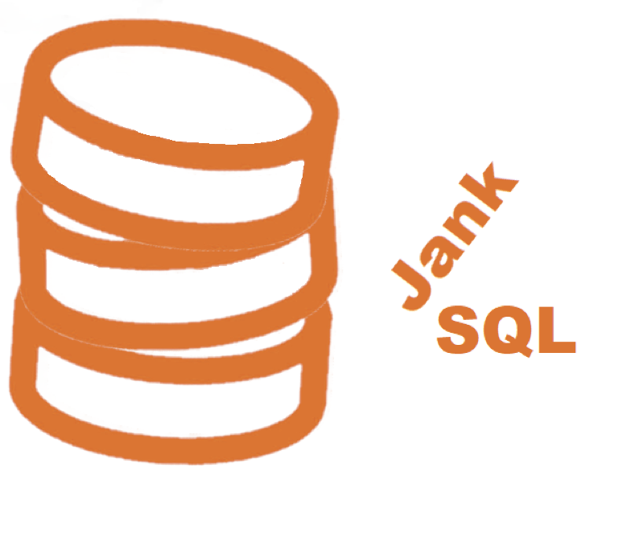

# JankSQL

This is a simple implementation of a SQL database server written in C#.

It's just me working on it, so it'll take forever to implement. As I go, I'll pick interesting tasks to work on and try to get them done, but at any moment the project is probably in some disarray -- but it *ought* to work for as much as is really done, despite any loose ends.

This project is completely silly: I have no goal aside from having something to do, and learning a bit as I go. JankSQL is *totally* [jank](https://www.urbandictionary.com/define.php?term=jank): redundant, un-finished, crooked, and a replacement of dubious quality.

Let's have even more fun: "JankSQL" is pronounced "janks queue ell".

## Motivation

I'm retired, and a bit bored. I've always wanted to try to glue together everything I know about software development, SQL, and databases into an actual database implementation -- but I've always been distracted by paying work. Now, I'm taking a run at it since I have some spare time. I don't have any particularly jarring insights into how anything might be faster or more efficient just yet. One idea I *do* have is eventually translating SQL into executable code rather than interpreted code. That's why I've chosen C# -- since I think I can emit IL, compile it, and host it in an environment that implements accessors for the rest of the structure.  Maybe I'll eventually get to that, but my approach is (as above) just to paw through the things that I think are personally interesting in the order I feel like attacking them.

And, really, doing work without a deadline and in the order that pleases me (instead of some PM or manager or external team or ...) is very refreshing and liberating.

Also, my wife said I'm not allowed to build a robot, so this project will have to suffice.

## Approach

### SQL Grammar

I've chosen to re-use an existing SQL grammar for parsing; even at my most ambitious, I can't hope to implement even half the features of the grammar, but it seems better than struggling along writing and fixing subsets of the grammar itself while I try to implement features.

On the other hand, we can expect that I'll want to extend the grammar to support features unique to JankSQL.

### Storage

The storage engine is based on the [CSharpTest.Net](https://github.com/csharptest/CSharpTest.Net.Collections) B-Tree implementation. The engines are pluggable through the `IEngine` and `IEngineTable` interfaces. Implementations for in-memory and on-disk storage against the CSharpTest B-Tree are supplied. A limited implementation against a CSV flat-file is also supplied.

### Tests

There are more than 750 tests now, though that's a bit multiplicative due to tests running against each engine. Strictly, the "unit" tests are a bit stretched -- they're probably a bit more integration tests, since they'll exercise multiple components in concert.

Tests are implemented with [NUnit](https://github.com/nunit/nunit).

### Style

The project uses [StyleCop](https://github.com/StyleCop) for static analysis. I've tweaked away some of the rules that I find more annoying or counter-productive 

# Setup 

This project uses .Net 6.0 and therefore requires Visual Studio 2022.

After that, the project has just two prerequisites: the Antlr tool and the external T-SQL grammar for Antlr.

## Installing Antlr
The first requirement is Antlr -- which, in turn, requires the Java run-time. The [Antlr installation instructions](https://github.com/antlr/antlr4/blob/master/doc/getting-started.md) explain how to get Antlr going, and I just added the Antlr JAR file to my `\bin` directory, which is already on my path.

## The T-SQL Antlr Grammar
Rather than write my own grammar as I go, I started with [an available Antlr grammar for T-SQL](https://github.com/antlr/grammars-v4/tree/master/sql/tsql). 

The `grammars-v4` project on GitHub contains many grammars, including the [sql/tsql](https://github.com/antlr/grammars-v4/tree/master/sql/tsql) grammar I chose. It's more than adequate! I may start paring-down unused features in it to make the parser a little smaller but more importantly faster.

The grammar's `*.g4` files live in the Parser directory, which uses the [Antlr4BuildTasks package](https://github.com/kaby76/Antlr4BuildTasks). I've added the SQL grammar files into this repository and they'll build into the `*.CS` implementation files as needed just by building the project.

## Shell

The JankSh project implements an interactive shell against a local engine. It's working against the in-memory B-Tree right now, and soon I'll have it able to attach to (or create) a directory and use that with the persisted B-Tree implementation.

## Status
The project is buildable, and I intend that the main branch always has all of its tests passing.

There are lots of language features being added as I work, so the best way to see what's supported is to scan through the tests.

# Licensing

This project is source-visible, but I retain full rights to its use and distribution. No warranty of any kind is given for someone who wants to reuse this code.

